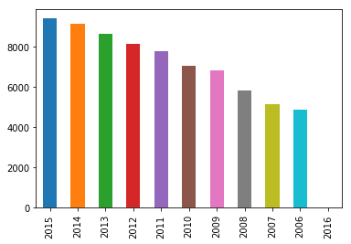
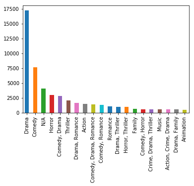
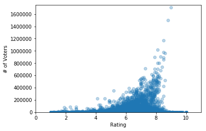

```python
from pprint import pprint
import networkx as nx
import json
import matplotlib.pyplot as plt
import pandas as pd
from datetime import datetime
import numpy as np
```

# Read Data


```python
try:
    with open('query/IMDb_data/IMDb2006-2015.json') as data_file:
        data = json.load(data_file)
except:
    print("No such file or directory: 'IMDb_data\\IMDb2006-2015.json'")
    exit()


def getData():
    return data

movies = getData()

movie = movies['tt0117743']
```


```python
movies_list = list(movies.values())
movies = movies.copy()
```


```python
list(movies_list[0].keys())
```


    ['Plot',
     'Rated',
     'Response',
     'Language',
     'Title',
     'Country',
     'Writer',
     'Metascore',
     'imdbRating',
     'Director',
     'Released',
     'Actors',
     'Year',
     'Genre',
     'Awards',
     'Runtime',
     'Type',
     'Poster',
     'imdbVotes',
     'imdbID']


```python
movies_list[51256]
```


    {'Plot': 'Upon losing his wife and son, Ahmet has to struggle with the feeling of loneliness.',
     'Rated': 'N/A',
     'Response': 'True',
     'Language': 'Turkish',
     'Title': 'Bulanti',
     'Country': 'Turkey',
     'Writer': 'Zeki Demirkubuz',
     'Metascore': 'N/A',
     'imdbRating': '6.4',
     'Director': 'Zeki Demirkubuz',
     'Released': '02 Oct 2015',
     'Actors': 'Zeki Demirkubuz, Sebnem Hassanisoughi, Öykü Karayel, Çaglar Çorumlu',
     'Year': '2015',
     'Genre': 'Drama',
     'Awards': '2 wins.',
     'Runtime': 'N/A',
     'Type': 'movie',
     'Poster': 'http://ia.media-imdb.com/images/M/MV5BZDg0NjQwNzctNWE4OC00NjAxLTkwNzMtNzdjNDFlZTRhM2Q3XkEyXkFqcGdeQXVyMTYzMDkwNjg@._V1_SX300.jpg',
     'imdbVotes': '554',
     'imdbID': 'tt5037996'}


# Data Processing & Cleaning


```python
for movie in movies_list:
    if movie['Year'].isdecimal() == False or int(movie['Year']) < 2006 or int(movie['Year']) > 2015:
        movies_list.remove(movie)
    else:
        movie['Released'] = datetime.strptime(movie['Released'], '%d %b %Y') if movie['Released'] != 'N/A' and type(movie['Released'])!='str' else None
        movie['imdbRating'] = float(movie['imdbRating']) if movie['imdbRating'] != 'N/A' else None
    
```


```python
df = pd.DataFrame(movies_list)
```

# Data Visualization


```python
year_count = df['Year'].value_counts()
print(year_count)
year_count.plot('bar')
```

    2015    9396
    2014    9160
    2013    8645
    2012    8154
    2011    7773
    2010    7068
    2009    6830
    2008    5831
    2007    5134
    2006    4894
    2016       1
    Name: Year, dtype: int64


    <matplotlib.axes._subplots.AxesSubplot at 0x1319536a0>





```python
genre_count = df['Genre'].value_counts().nlargest(20)
print(genre_count)
genre_count.plot('bar')
```

    Drama                     17253
    Comedy                     7703
    N/A                        4061
    Horror                     3020
    Comedy, Drama              2862
    Thriller                   2047
    Drama, Romance             1694
    Action                     1491
    Comedy, Drama, Romance     1382
    Comedy, Romance            1316
    Romance                    1053
    Drama, Thriller            1022
    Horror, Thriller            988
    Family                      689
    Comedy, Horror              577
    Crime, Drama, Thriller      572
    Music                       568
    Action, Crime, Drama        564
    Drama, Family               563
    Animation                   539
    Name: Genre, dtype: int64


    <matplotlib.axes._subplots.AxesSubplot at 0x1244cd748>





# Top 30 Voted:


```python
from query import top30movies_rating_voting
```

    1	What the Flowers Have Brought Us	 rating:10.0
    1	Someone to Carry Me	 rating:10.0
    1	Orange Grove	 rating:10.0
    1	For the Cause	 rating:10.0
    1	Porkchop and a Glass of Water	 rating:10.0
    1	Gumboot Kids	 rating:10.0
    1	Dancing Alone	 rating:10.0
    1	Hindsight 2020	 rating:10.0
    1	Achena Prem	 rating:10.0
    1	Bhalobasar Anek Naam	 rating:10.0
    1	Bangland	 rating:10.0
    2	Jan Quadrant Vincent 16	 rating:9.8
    2	The Stones of Okella	 rating:9.8
    2	Yeardley	 rating:9.8
    2	Millie and the Lords	 rating:9.8
    3	A Father's Journey	 rating:9.7
    3	Beatbox	 rating:9.7
    3	Homecoming	 rating:9.7
    3	Canadian Dream	 rating:9.7
    3	Unspeakable Indiscretions	 rating:9.7
    3	Hing Ting Chot	 rating:9.7
    3	Brush	 rating:9.7
    4	Qlub Imwegggha	 rating:9.6
    4	Inbrottet	 rating:9.6
    4	Summertime	 rating:9.6
    4	Miles Away	 rating:9.6
    4	The Industry	 rating:9.6
    4	Yume no mani mani	 rating:9.6
    4	Patna Se Pakistan	 rating:9.6
    4	Jazzed Up Hoodlums	 rating:9.6
    4	Eating Saltines	 rating:9.6
    4	Profile	 rating:9.6
    4	From Grace	 rating:9.6
    -------------separate-------------
    1	The Dark Knight	 voters:1,713,318
    2	Inception	 voters:1,501,172
    3	The Dark Knight Rises	 voters:1,171,737
    4	The Avengers	 voters:1,016,311
    5	Django Unchained	 voters:982,827
    6	Interstellar	 voters:961,788
    7	Inglourious Basterds	 voters:909,244
    8	Avatar	 voters:899,776
    9	The Departed	 voters:894,160
    10	The Prestige	 voters:860,347
    11	Shutter Island	 voters:805,512
    12	The Wolf of Wall Street	 voters:804,969
    13	WALL·E	 voters:735,150
    14	The Hunger Games	 voters:712,375
    15	Guardians of the Galaxy	 voters:708,900
    16	Iron Man	 voters:708,021
    17	Up	 voters:681,865
    18	Slumdog Millionaire	 voters:649,767
    19	The Hobbit: An Unexpected Journey	 voters:648,272
    20	No Country for Old Men	 voters:629,158
    21	300	 voters:617,439
    22	Star Wars: The Force Awakens	 voters:595,345
    23	The Hangover	 voters:591,952
    24	Gravity	 voters:590,779
    25	Gone Girl	 voters:590,196
    26	Mad Max: Fury Road	 voters:577,243
    27	Gran Torino	 voters:570,455
    28	Iron Man 3	 voters:567,520
    29	Black Swan	 voters:561,063
    30	Man of Steel	 voters:560,710
    No common movie


# Rating-Voting Correlation


```python
N = len(movies)
x,y=[],[]
xMax=0
yMax=0

for key, movie in movies.items():
    try:
        y1 = int(movie["imdbVotes"].replace(",",""))
        x1 = float(movie["imdbRating"])
        x.append(x1)
        y.append(y1)
        if x1>xMax:
            xMax = x1
        if y1>yMax:
            yMax = y1
    except:
        continue


plt.scatter(x,y, alpha=0.3)
plt.xlim(0,xMax+xMax*0.1)
plt.ylim(0,yMax+yMax*0.02)
plt.xlabel('Rating')
plt.ylabel('# of Voters')
plt.savefig('rating_voting_correlation.png')
plt.show()
```





For one thing, we can see that the relation of # of voters and rating.  #of voters are proportional to the ratings.  More voters always have a great rating.  It means more voters implies greater rating.  In reality reasoning, I think this is a chain effect, better rating implies more people to watch.  Then, if the audience think this is go, they will go giving a great rating. Then this will be a snow ball accumulate. But not all audience will give a great rating.  The minority will lower the rating but not affecting the rating significantly.

Second, I think the distribution or variant of the rating is unstable on small amount of voters.  We can see that on the graph.  The rating of movie whose # of voters lower than 200,000 is distributed over 1 to 10.  It is because every voter contributes greater proportion of the rating.  Small size of voters may imply the movie is some rarely category, sub culture movie or those actually have a bad rating in previous history.

In conclusion, I think if the # of voters more, then the rating will be more stable and more centralize to 5-8 (ratings).  Moreover, more # of voters also mean this movie is popular.  This always implies the movie is suitable for majority. 


# Top-10 Collaborative Actors


```python
from query import top10actors
```

    Brahmanandam, 415
    Prakash Raj, 242
    Eric Roberts, 234
    Ali, 233
    Mihir Das, 224
    Michael Madsen, 195
    Mohanlal, 177
    Ravi Kishan, 173
    Mammootty, 171
    Danny Trejo, 162

